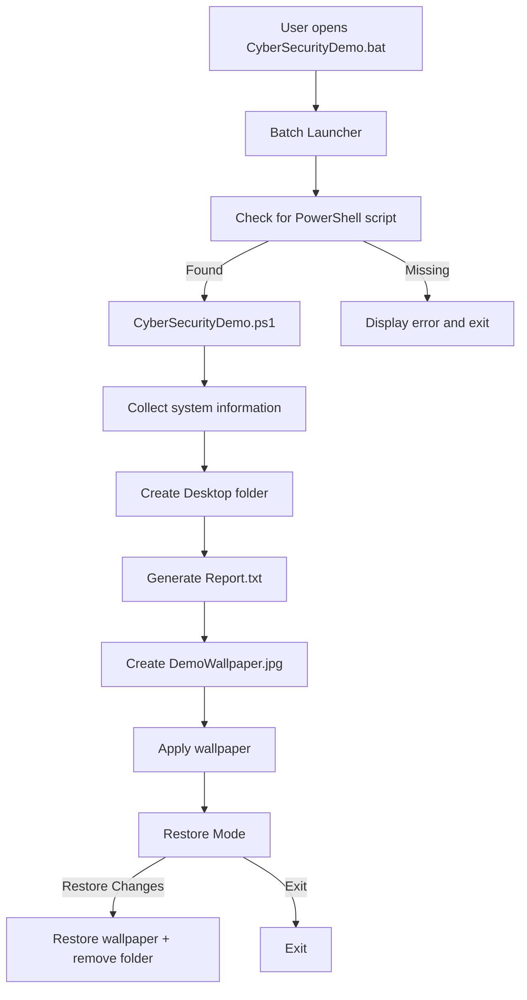

<div align="center">

# Windows Security Demonstration

**See how much a Windows script can create, modify, and delete without asking for administrator permission.**

[](#requirements)
[](#tech-stack)
[](#project-structure)
[](#security-concept)
[](#educational-purpose)

</div>

<br/>

## Overview

**Windows Security Demonstration** is a small security-awareness project built with a Windows Batch launcher and a PowerShell script.

The project demonstrates a simple but important security concept:

> **Without asking for administrator permission, a script can create new files, modify files, and delete almost any file or folder that the current user has access to.**

It can also create completely new files in different formats such as `.txt`, `.png`, `.mp4`, `.pdf`, `.zip`, and more. The current demonstration shows this concept through controlled system-information collection, file creation, report generation, wallpaper modification, and a restore option.

The goal is not to create malware. The goal is to make the security implication easy to understand: **opening a script gives it the same permissions available to the user who launched it.**

---

## Table of Contents

- [The Security Concept](#the-security-concept)
- [The Problem](#the-problem)
- [What This Demo Does](#what-this-demo-does)
- [Why No Administrator Permission Is Needed](#why-no-administrator-permission-is-needed)
- [Execution Flow](#execution-flow)
- [Key Features](#key-features)
- [Generated Output](#generated-output)
- [Expandable Security Demonstrations](#expandable-security-demonstrations)
- [Security Implications](#security-implications)
- [Safety Boundaries](#safety-boundaries)
- [Tech Stack](#tech-stack)
- [Project Structure](#project-structure)
- [Requirements](#requirements)
- [Getting Started](#getting-started)
- [Demo Walkthrough](#demo-walkthrough)
- [Engineering Highlights](#engineering-highlights)
- [Limitations](#limitations)
- [Future Direction](#future-direction)
- [Educational Purpose](#educational-purpose)
- [License](#license)

---

## The Security Concept

Windows applications normally run with the permissions of the user who launched them unless they request elevation.

That means:

```text
No UAC Prompt
      ≠
Nothing Happened
```

A normal user account can already:

- Read many pieces of system information
- Access resources available to that user
- Create files in user-controlled locations
- Modify user-level settings
- Run scripts and programs available to that account

The demonstration intentionally stays within this boundary.

The interesting part is what happens when **several ordinary operations are chained together**.

---

## The Problem

Security awareness often focuses on administrator permissions and UAC prompts.

But a program can still have a meaningful impact without ever asking for administrator access.

A malicious or untrusted script could potentially combine ordinary user-level actions into a much larger sequence.

This project makes that idea visible through a controlled demonstration.

### Questions this project demonstrates

- What can a script do immediately after the user opens it?
- What information is already available to an ordinary user?
- Which user-level settings can be changed without elevation?
- How can multiple small operations be chained together?
- Why should unknown scripts be treated as executable code rather than ordinary documents?

---

## The Most Important Capability

The most important part of this project is **file-system access**.

A script running without administrator privileges can still have significant control over files and folders that the current user is allowed to access.

### It can create files

A program does not need a special permission for each file type. It can create completely new files such as:

```text
example.txt
image.png
video.mp4
document.pdf
archive.zip
data.bin
```

The file extension is not the security boundary. The important question is whether the process has permission to write to that location.

### It can delete files and folders

It can delete **almost any file or folder that the current user has permission to delete**.

That can include:

- Personal files
- Downloaded files
- Documents
- Images
- Videos
- User-created folders
- Other writable data

Protected Windows/system locations or files that the current user cannot access are a different boundary and may reject the operation.

### Why this matters

For a normal user, the important takeaway is:

> **No administrator prompt does not mean a script is harmless.**

If you give a script permission to run as your user, it can potentially perform the file operations that you are allowed to perform.

## What This Demo Does

### 🖥️ Collects System Information

The PowerShell script retrieves:

- Username
- Computer name
- Windows version and build
- CPU architecture
- Primary screen resolution
- Current date and time

### 📁 Creates and Writes Files

Creates a Desktop folder and writes new files into it.

The same Windows file-writing capability can be used for many file types, depending on the data supplied to the file.

### 📝 Generates a Report

The collected information is written to:

```text
CyberSecurity_Demo/Report.txt
```

### 🖼️ Changes the Current User's Wallpaper

A demonstration image embedded in the script is written as:

```text
DemoWallpaper.jpg
```

and applied as the current user's wallpaper.

### ↩️ Restores the Changes

Before changing the wallpaper, the original value is stored.

The user can select **Restore Changes** to restore the wallpaper and remove the generated demonstration folder.

---

## Why No Administrator Permission Is Needed

The current demonstration uses operations available within the permissions of the user running it.

It does **not** attempt to modify protected system files, install system-wide components, escalate privileges, or disable security software.

The basic model is:

```text
Script
  ↓
Current User
  ↓
Current User's Permissions
  ↓
Accessible Resources
```

So the absence of a UAC prompt should not automatically be interpreted as proof that a file is harmless.

---

## Execution Flow



---

## Key Features

### System Discovery

Uses Windows system interfaces to retrieve basic environment information available to the current user.

### Automated File Operations

Creates a dedicated folder and generates a structured text report without requiring administrator access.

### User-Level Configuration Change

Uses the Windows wallpaper API to demonstrate a visible change to the current user's environment.

### Transparent Progress Display

The terminal shows each stage of the demonstration and its progress.

### Reversible Changes

The previous wallpaper is captured before modification, allowing the demonstration to restore the original state.

### Self-Contained Demo Asset

The demonstration wallpaper is embedded directly in the PowerShell script as Base64 data, so no external image file is required.

---

## Generated Output

After execution:

```text
Desktop/
└── CyberSecurity_Demo/
    ├── Report.txt
    └── DemoWallpaper.jpg
```

Selecting **Restore Changes** removes the generated folder and restores the previous wallpaper.

---

## Expandable Security Demonstrations

The current project is deliberately small. Its larger value is the execution model:

```text
Open File
    ↓
Execute Code
    ↓
Discover
    ↓
Read / Write
    ↓
Modify User-Level Resources
```

The same controlled framework can be expanded into a broader security-awareness laboratory.

### 🔎 Environment Discovery

Future demonstrations could show additional categories of information available to an executing program, such as:

- Environment variables
- Running-process information
- Network configuration
- Installed software
- Additional operating-system configuration

The purpose would be to demonstrate **information exposure**, not to collect or transmit real sensitive data.

### 🗑️ File & Folder Deletion Demonstration

A controlled lab could create dummy files and folders, then demonstrate what an ordinary user-level process can remove when it has write/delete permission.

This can teach:

- Why writable data is important
- The difference between user-owned and protected files
- Why a lack of UAC does not protect personal data
- How destructive file operations can become dangerous when triggered by untrusted code

The demonstration should remain restricted to intentionally created lab data.

### 📂 File Permission Demonstration

A controlled lab could create dummy sensitive-looking files and demonstrate which files an ordinary user-level process can access.

This can teach:

- Windows file permissions
- User-owned data
- Least privilege
- Why UAC status is not the same as file-access security

### ⚙️ User-Level Configuration

The wallpaper example can be extended into other **reversible** user-level configuration demonstrations.

This helps visualize the difference between:

```text
System-wide modification
        vs.
Current-user modification
```

### 🧩 Multi-Stage Execution

The project already uses:

```text
BAT → PowerShell → Windows APIs
```

A larger version could demonstrate how several individually harmless operations can form a more significant execution chain.

### 🧪 Simulated Attack Events

Security concepts such as persistence, credential-access attempts, or privilege escalation can be represented as **simulations** that stop before performing harmful actions.

For example:

```text
[SIMULATION]
Persistence attempt
[BLOCKED]

[SIMULATION]
Credential access attempt
[BLOCKED]

[SIMULATION]
Privilege escalation attempt
[BLOCKED]
```

### 🛡️ Detection Layer

The project could eventually include a monitoring component:

```text
Demo Script
     ↓
System Activity
     ↓
Detection Layer
     ↓
Alert
     ↓
Explanation
```

That would turn the project from a simple execution demonstration into a small **attack-vs-defense security lab**.

---

## Security Implications

### 1. UAC Is Not a Universal Safety Indicator

UAC becomes relevant when an application requests an elevation boundary.

A program can still perform many actions without crossing that boundary.

### 2. User Permissions Matter

A script generally operates within the security context under which it runs.

Therefore:

```text
Script Permissions
        ↓
Current User Permissions
        ↓
Accessible Resources
```

The actual impact depends on the system's configuration and permissions.

### 3. Small Capabilities Can Be Chained

The current project combines:

```text
Read information
      +
Create files
      +
Generate data
      +
Modify a setting
```

None of these operations individually requires administrator access, but together they provide a clear demonstration of what user-level code can accomplish.

### 4. A File Can Be an Execution Mechanism

The project demonstrates:

```text
.bat
 ↓
PowerShell
 ↓
Code Execution
```

This is why users should be careful with unknown scripts, downloads, and attachments.

---

## Safety Boundaries

This repository is designed for **security awareness and controlled experimentation**.

The current implementation does **not** perform:

- Credential theft
- Password extraction
- Privilege escalation
- Security-software disabling
- Persistence
- Stealth or evasion
- Self-propagation
- Destructive file operations
- Remote command-and-control
- Data exfiltration

Any future security simulations should remain controlled, reversible, and restricted to systems and data authorized for testing.

---

## Tech Stack

| Layer | Technology |
|---|---|
| **Launcher** | Windows Batch (`.bat`) |
| **Automation** | PowerShell |
| **System Information** | CIM / Windows environment APIs |
| **File Operations** | PowerShell filesystem APIs |
| **Wallpaper API** | Windows `user32.dll` |
| **Image Asset** | Embedded Base64 JPEG |
| **Output** | Local text report + image |
| **Target Platform** | Windows |

---

## Project Structure

```text
windows-security-demonstration/
│
├── CyberSecurityDemo.bat       # Batch launcher
├── CyberSecurityDemo.ps1       # Main PowerShell demonstration
├── README.md                   # Project documentation
├── .gitignore                  # Ignores generated demo output
└── LICENSE                     # Project license
```

### PowerShell Responsibilities

```text
CyberSecurityDemo.ps1
│
├── Show-Header
├── Show-Intro
├── Show-ProgressLine
├── Get-SystemInfoData
├── Write-Report
├── New-DemoWallpaper
└── Set-Wallpaper
```

---

## Requirements

- Windows 10 or later recommended
- Windows PowerShell
- `powershell.exe`
- Standard Windows system APIs

No external PowerShell modules are required.

No Python or Node.js installation is required.

The current demonstration does not require administrator privileges.

---

## Getting Started

### 1. Clone the repository

```bash
git clone https://github.com/<your-username>/windows-security-demonstration.git
cd windows-security-demonstration
```

### 2. Keep both scripts together

```text
CyberSecurityDemo.bat
CyberSecurityDemo.ps1
```

The Batch launcher automatically locates the PowerShell file in its own directory.

### 3. Run the demonstration

Double-click:

```text
CyberSecurityDemo.bat
```

### 4. Observe the output

The PowerShell window displays the operations and progress.

### 5. Restore

Choose:

```text
1. Restore Changes
```

to restore the wallpaper and remove the generated demonstration folder.

---

## Demo Walkthrough

1. **Open the BAT file** — the demonstration starts without an administrator/UAC prompt.
2. **System discovery** — basic local information is collected and displayed.
3. **Folder creation** — `CyberSecurity_Demo` appears on the Desktop.
4. **Report generation** — `Report.txt` contains the collected information.
5. **Wallpaper change** — the demonstration wallpaper becomes the current user's wallpaper.
6. **Restore** — the original wallpaper and local state can be restored.

---

## Engineering Highlights

### Modular PowerShell Design

Major operations are separated into functions, making the demonstration easier to read and extend.

### Windows API Integration

The wallpaper operation demonstrates how PowerShell can interact with a native Windows API through `user32.dll`.

### Reversible State

The previous wallpaper is stored before modification, providing a safe restoration path.

### Self-Contained Asset

The wallpaper is embedded in the script, keeping the demonstration portable.

### Error Handling

The script uses a top-level `try/catch` structure and stops on terminating errors rather than silently ignoring failures.

---

## Limitations

This is intentionally **not a malware framework**.

It is a proof-of-concept focused on demonstrating the security implications of executing code with ordinary user permissions.

The current version:

- Does not communicate with a remote server
- Does not steal credentials
- Does not bypass Windows security controls
- Does not escalate privileges
- Does not install persistence
- Does not hide its activity
- Does not spread to other machines
- Does not destroy user data

The project demonstrates the **concept of user-level execution**, not a complete attack chain.

---

## Future Direction

A larger version could evolve into a small interactive security laboratory:

```text
Phase 1
Current Demonstration
        ↓
Phase 2
Security Awareness Modules
        ↓
Phase 3
Detection & Monitoring
        ↓
Phase 4
Controlled Attack Simulations
```

The long-term objective would be to show both sides:

```text
What Can Execute?
        ↓
What Can It Access?
        ↓
What Can It Change?
        ↓
How Can We Detect It?
        ↓
How Can We Prevent It?
```

---

## Educational Purpose

This project is built around one simple question:

> **"If I open a file and Windows does not ask me for administrator permission, how much can that file actually do?"**

The current demonstration provides a visible answer:

```text
Execute Code
     ↓
Read System Information
     ↓
Create Files
     ↓
Generate Data
     ↓
Modify User-Level Settings
```

The point is not to make the project dangerous.

The point is to make the **danger of blindly executing code** easier to understand.

---

## License

Released under the **MIT License**.

Use this project for learning, demonstrations, and authorized security-awareness exercises.

---

<div align="center">

**Windows Security Demonstration**

*Small script. Bigger security lesson.*

</div>
